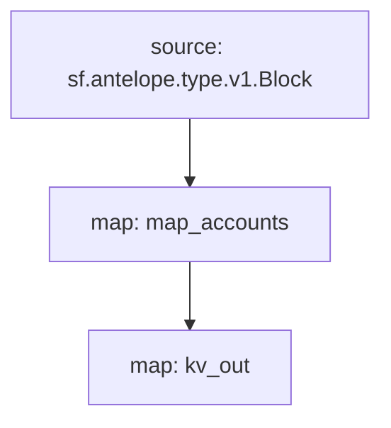

# Antelope `accounts` Substream

> Antelope newly created accounts

### Releases

[v0.2.0](https://github.com/pinax-network/substreams/releases/tag/accounts-v0.2.0)

### Quickstart

```
substreams gui -e eos.firehose.eosnation.io:9001 https://github.com/pinax-network/substreams/releases/download/accounts-v0.2.0/accounts-v0.2.0.spkg map_accounts -s 1000 -t +10000
```

### Build, Run & Sink from source

```bash
$ make
$ make run
$ make sink
```

### Graph



### Modules

```yaml
Package name: accounts
Version: v0.2.0
Doc: Antelope newly created accounts
Modules:
----
Name: map_accounts
Initial block: 0
Kind: map
Output Type: proto:antelope.accounts.v1.Accounts
Hash: 7caf4768b99635f7cece3853ddf0a98c2d222dca

Name: kv_out
Initial block: 0
Kind: map
Output Type: proto:sf.substreams.sink.kv.v1.KVOperations
Hash: 37066d5ef69e1426d419af44ae6514bcde21fa2d
```
