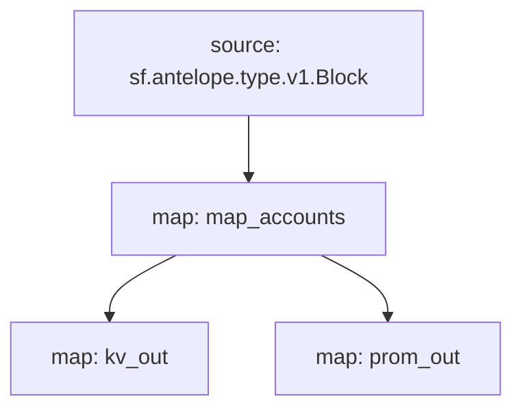

# Antelope `accounts` Substream

> Antelope newly created accounts

### [Latest Releases](https://github.com/pinax-network/substreams/releases)

### Sinks
- [Prometheus](https://github.com/pinax-network/substreams-sink-prometheus)
- [KV](https://github.com/streamingfast/substreams-sink-kv)

### Quickstart

```bash
$ make
$ make run
$ make sink
```

### Graph



### Modules

```yaml
Package name: accounts
Version: v0.3.3
Doc: Antelope newly created accounts
Modules:
----
Name: map_accounts
Initial block: 0
Kind: map
Output Type: proto:antelope.accounts.v1.Accounts
Hash: d6b84a74fb68cf373e34706f03106972a9c2fe26

Name: kv_out
Initial block: 0
Kind: map
Output Type: proto:sf.substreams.sink.kv.v1.KVOperations
Hash: 58e3e9e646dee281fb4c54ccc956b9ff4a39238d

Name: prom_out
Initial block: 0
Kind: map
Output Type: proto:pinax.substreams.sink.prometheus.v1.PrometheusOperations
Hash: abbadd50799ade00ee2e5aeb66faa25795f9eb10
```