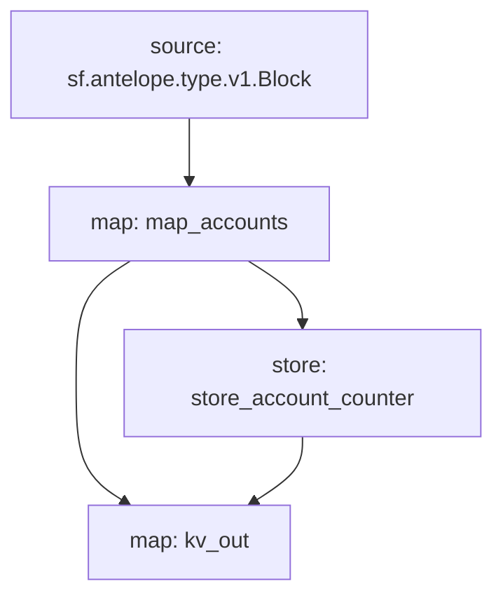

# Antelope `accounts` Substream

> Antelope accounts streaming

### Releases:
[v0.1.0](https://github.com/pinax-network/substreams/releases/download/accounts-v0.1.0/accounts-v0.1.0.spkg)

### Running a release

```
substreams gui -e eos.firehose.eosnation.io:9001 https://github.com/pinax-network/substreams/releases/download/accounts-v0.1.0/accounts-v0.1.0.spkg map_accounts -s 1000 -t +1000
```

### Building from Source

```
$ make codegen
$ make build
$ make stream
```


### Graph



### Modules

```yaml
Package name: accounts
Version: v0.1.0
Modules:
----
Name: map_accounts
Initial block: 0
Kind: map
Output Type: proto:antelope.accounts.v1.Accounts
Hash: 364f9549d80bae80b7ca6e30815627307108b524

Name: store_account_counter
Initial block: 0
Kind: store
Value Type: int64
Update Policy: UPDATE_POLICY_ADD
Hash: 4c5d9bf0df18c537b20aa118b501e5ef1daae105

Name: kv_out
Initial block: 0
Kind: map
Output Type: proto:sf.substreams.sink.kv.v1.KVOperations
Hash: cda13af1f8b5162dbd5f68ea9cadd31f243b6c43
```
