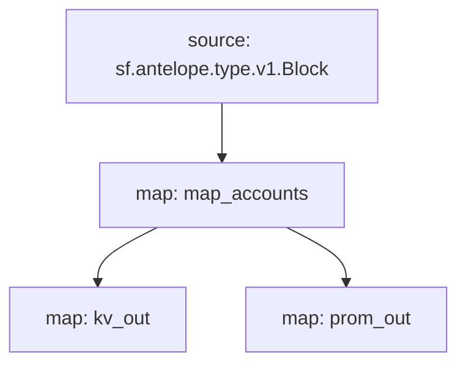

# Antelope `accounts` Substream

> Antelope newly created accounts

### [Latest Releases](https://github.com/pinax-network/substreams/releases)

### Sinks
- [Prometheus](https://github.com/pinax-network/substreams-sink-prometheus.rs)
- [KV](https://github.com/streamingfast/substreams-sink-kv)

### Quickstart

```bash
$ make
$ make run
$ make sink
```

### Graph



### Modules

```yaml
Package name: accounts
Version: v0.3.3
Doc: Antelope newly created accounts
Modules:
----
Name: map_accounts
Initial block: 0
Kind: map
Output Type: proto:antelope.accounts.v1.Accounts
Hash: acb37d0e14b396dfdffa487d509e7ab0fbb644a7

Name: kv_out
Initial block: 0
Kind: map
Output Type: proto:sf.substreams.sink.kv.v1.KVOperations
Hash: 46bedecff46cee3831f7225c560d25fa714f0ee9

Name: prom_out
Initial block: 0
Kind: map
Output Type: proto:pinax.substreams.sink.prometheus.v1.PrometheusOperations
Hash: 778a2da41b445c1afe4dab3843a72e16fd72d28a
```