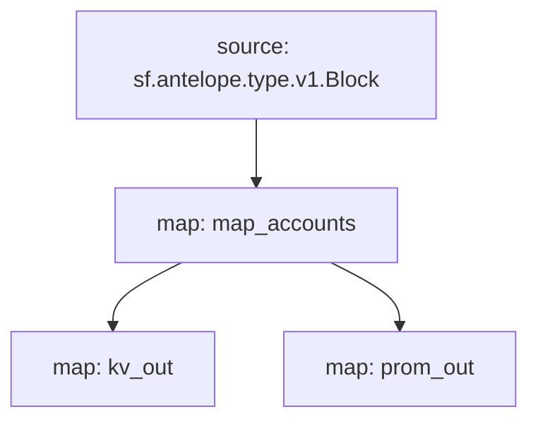

# Antelope `accounts` Substream

> Antelope newly created accounts

### [Latest Releases](https://github.com/pinax-network/substreams/releases)

### Sinks
- [Prometheus](https://github.com/pinax-network/substreams-sink-prometheus)
- [KV](https://github.com/streamingfast/substreams-sink-kv)

### Quickstart

```bash
$ make
$ make run
$ make sink
```

### Graph



### Modules

```yaml
Package name: accounts
Version: v0.3.2
Doc: Antelope newly created accounts
Modules:
----
Name: map_accounts
Initial block: 0
Kind: map
Output Type: proto:antelope.accounts.v1.Accounts
Hash: 05b16295bbbf27fd3d7420fddcfad0380fe04347

Name: kv_out
Initial block: 0
Kind: map
Output Type: proto:sf.substreams.sink.kv.v1.KVOperations
Hash: 56d880831ca44b8f3d37cc6784008622f1084623

Name: prom_out
Initial block: 0
Kind: map
Output Type: proto:pinax.substreams.sink.prometheus.v1.PrometheusOperations
Hash: 75e8befd77bf6dc791c95272d40c2e5d0e41526b
```