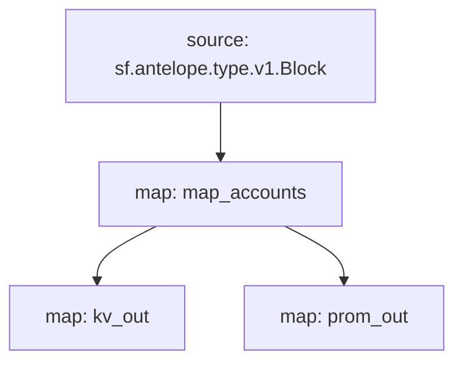

# Antelope `accounts` Substream

> Antelope newly created accounts

### Releases

[v0.2.0](https://github.com/pinax-network/substreams/releases/tag/accounts-v0.2.0)

### Quickstart

```
substreams gui -e eos.firehose.eosnation.io:9001 https://github.com/pinax-network/substreams/releases/download/accounts-v0.2.0/accounts-v0.2.0.spkg map_accounts -s 1000 -t +10000
```

### Build, Run & Sink from source

```bash
$ make
$ make run
$ make sink
```

### Graph



### Modules

```
Name: map_accounts
Initial block: 0
Kind: map
Output Type: proto:antelope.accounts.v1.Accounts
Hash: cf0ca8345f56774a4fb8891997bb799c52f91337

Name: kv_out
Initial block: 0
Kind: map
Output Type: proto:sf.substreams.sink.kv.v1.KVOperations
Hash: 79cf43959571be1c7745881d51abd48053de81d4

Name: prom_out
Initial block: 0
Kind: map
Output Type: proto:pinax.substreams.sink.prometheus.v1.PrometheusOperations
Hash: 11c6de5a7f0c176225f149450b06ddf58996bfbb
```