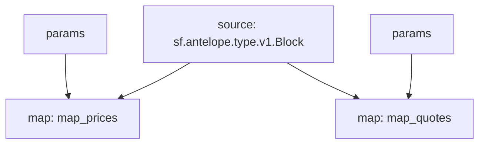

# Antelope Oracles Substream

> Antelope Oracles prices from [`delphioracle`](https://bloks.io/account/delphioracle) and [`oracle.defi`](https://bloks.io/account/oracle.defi)

### [Latest Releases](https://github.com/pinax-network/substreams/releases)

### Quickstart

```bash
$ make
$ make delphioracle # quotes
$ make oracle.defi # prices
```

**delphioracle**
```proto
message Datapoint {
  uint64 id = 1;
  uint64 median = 2;
  string owner = 3;
  string timestamp = 4;
  uint64 value = 5;
}

message Quote {
  string pair = 1;
  Datapoint value = 2;
}
```

**oracle.defi**
```proto
message Price {
    uint64 id = 1;
    string contract = 2;
    string coin = 3;
    uint32 precision = 4;
    uint64 acc_price = 5;
    uint64 last_price = 6;
    uint64 avg_price = 7;
    string last_update = 8;
}
```

### Mermaid graph



### Modules

```yaml
Package name: antelope_oracles
Version: v0.0.5
Doc: Antelope `eosio.token` based action traces & database operations.
Modules:
----
Name: map_prices
Initial block: 0
Kind: map
Output Type: proto:antelope.oracles.v1.Prices
Hash: 6d5f12fd8fdac6fc38902db1552abbe5469b8a99

Name: map_quotes
Initial block: 0
Kind: map
Output Type: proto:antelope.oracles.v1.Quotes
Hash: 7c8d5104d1baeedd15ba61da4a97bdda10024ba0
```