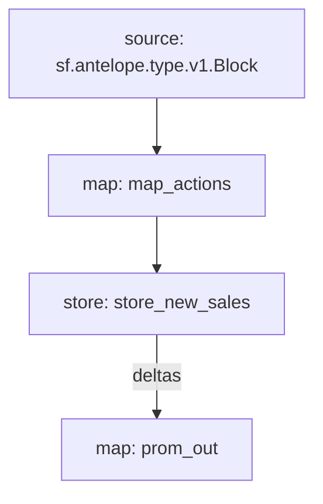

# `AtomicMarket` Substream

> Metrics for [AtomicHub Market](https://eos.atomichub.io/).

### [Latest Releases](https://github.com/pinax-network/substreams/releases)

### Sinks
- [Prometheus](https://github.com/pinax-network/substreams-sink-prometheus)

### Quickstart

```bash
$ make
$ make run
$ make sink
```

### Mermaid graph



### Modules

```yaml
Package name: atomicmarket
Version: v0.1.0
Doc: Metrics for AtomicHub Market
Modules:
----
Name: map_actions
Initial block: 0
Kind: map
Output Type: proto:sf.antelope.type.v1.ActionTraces
Hash: af6066dd857f3c32022a5fcb2939a37545b09078

Name: store_new_sales
Initial block: 230068212
Kind: store
Value Type: int64
Update Policy: UPDATE_POLICY_ADD
Hash: 760b80bb73e314531ba7ea4dbca61c4c50ed1aea

Name: prom_out
Initial block: 230068212
Kind: map
Output Type: proto:pinax.substreams.sink.prometheus.v1.PrometheusOperations
Hash: 49dcfc248555af505d97bd0b04fd78c733def92a
```