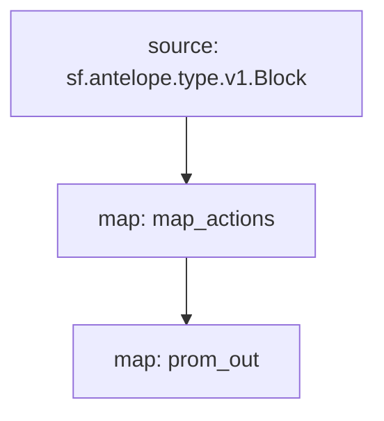

# `AtomicMarket` Substream

> Metrics for [AtomicHub Market](https://eos.atomichub.io/).

### [Latest Releases](https://github.com/pinax-network/substreams/releases)

### Sinks
- [Prometheus](https://github.com/pinax-network/substreams-sink-prometheus)

### Quickstart

```bash
$ make
$ make run
$ make sink
```

### Mermaid graph



### Modules

```yaml
Package name: atomicmarket
Version: v0.1.0
Doc: Metrics for AtomicHub Market
Modules:
----
Name: map_actions
Initial block: 0
Kind: map
Output Type: proto:sf.antelope.type.v1.ActionTraces
Hash: d3148b95376b0a7ddd2fcffd26fac596ab673132

Name: prom_out
Initial block: 0
Kind: map
Output Type: proto:pinax.substreams.sink.prometheus.v1.PrometheusOperations
Hash: c02185915646414b8d5f59d15ec50e8bd8e9ef5e
```