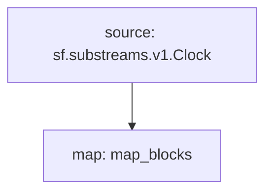

# Clock Substream

> Common "clock" substream that works for any substreams-instrumented firehose endpoint

## Usage
```bash
$ make build

$ make eth
$ make bitcoin
$ make bsc
$ make eos
```

## Graph


## Info
```yaml
Package name: blocks
Version: v0.1.0
Doc: Blocks
Modules:
----
Name: map_blocks
Initial block: 2
Kind: map
Input: source: sf.substreams.v1.Clock
Output Type: proto:sf.substreams.v1.Clock
Hash: 44c506941d5f30db6cca01692624395d1ac40cd1
```