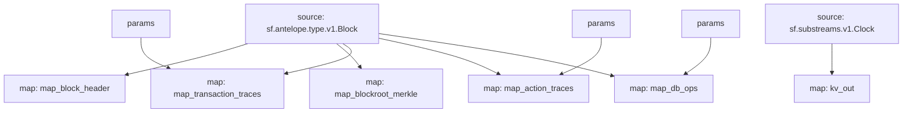

# Antelope `Common` Substream

> Antelope **action traces** & **database operations**.

### [Latest Releases](https://github.com/pinax-network/substreams/releases)

### Quickstart

```bash
$ make
$ make run
```

### KV

- `block.number:<number>` -> `BlockTimestamp`
- `block.timestamp:<timestamp>` -> `BlockId`

**proto**
```protobuf
message BlockId {
  string id = 1;
  uint64 number = 2;
}

message BlockTimestamp {
  string timestamp = 1;
}
```

### Params

Params allow to filter messages and can be supplied to modules in the form of URL query, i.e. `contract=eosio.token&action=transfer` - filter `eosio.token` contract `transfer` actions.

| module       | key        | description |
|--------------|------------|-------------|
| `map_transaction_traces` | `contract` | filter by contract(s)
| `map_transaction_traces` | `action`   | filter by action(s)
| `map_transaction_traces` | `receiver`   | filter by receiver(s)
| `map_action_traces` | `contract` | filter by contract(s)
| `map_action_traces` | `action`   | filter by action(s)
| `map_action_traces` | `receiver`   | filter by receiver(s)
| `map_db_ops` | `contract` | filter by contract(s)
| `map_db_ops` | `table`   | filter by action(s)

## Mermaid graph



### Modules

```yaml
Package name: common
Version: v0.7.0
Doc: Antelope based action traces & database operations.
Modules:
----
Name: map_block_header
Initial block: 2
Kind: map
Output Type: proto:sf.antelope.type.v1.BlockHeader
Hash: 5d92d369cafe11d367797cb76e7596a85ac53233

Name: map_blockroot_merkle
Initial block: 2
Kind: map
Output Type: proto:sf.antelope.type.v1.BlockRootMerkle
Hash: 85da537db3ac419c47fddd4de48cd949905ffb8d

Name: map_transaction_traces
Initial block: 2
Kind: map
Output Type: proto:sf.antelope.type.v1.TransactionTraces
Hash: 5f45b71f0d9f3d6764fcaad99ec55165c886b68d

Name: map_action_traces
Initial block: 2
Kind: map
Output Type: proto:sf.antelope.type.v1.ActionTraces
Hash: e126ffb8870882e620a7d125d58eabe0cc75e1e4

Name: map_db_ops
Initial block: 2
Kind: map
Output Type: proto:sf.antelope.type.v1.DBOps
Hash: 50f1ae024c4f9536618454d7de529411c6f4f9e9

Name: kv_out
Initial block: 0
Kind: map
Output Type: proto:sf.substreams.sink.kv.v1.KVOperations
Hash: b311d8b665b19fd353e4937e9af297c72d98c08d
```