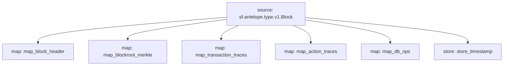

# Antelope `Common` Substream

> Antelope **action traces** & **database operations**.

### [Latest Releases](https://github.com/pinax-network/substreams/releases)

### Quickstart

```bash
$ make
$ make run
```

## Mermaid graph



### Modules

```yaml
Package name: common
Version: v0.3.0
Doc: Antelope based action traces & database operations.
Modules:
----
Name: map_block_header
Initial block: 2
Kind: map
Output Type: proto:sf.antelope.type.v1.BlockHeader
Hash: 4938a193662ecc692410a826b4b4480a4a74f6e7

Name: map_blockroot_merkle
Initial block: 2
Kind: map
Output Type: proto:sf.antelope.type.v1.BlockRootMerkle
Hash: 7b203830ca24aa79a7c396fd69d58080243401b2

Name: map_transaction_traces
Initial block: 2
Kind: map
Output Type: proto:sf.antelope.type.v1.TransactionTraces
Hash: 7677f6fba4957f44adb34a6245df96862dac5cc1

Name: map_action_traces
Initial block: 2
Kind: map
Output Type: proto:sf.antelope.type.v1.ActionTraces
Hash: beeedfc6447b202bcdc0854631f7ebdc16bc9a53

Name: map_db_ops
Initial block: 2
Kind: map
Output Type: proto:sf.antelope.type.v1.DBOps
Hash: a46d52708fe11dc3c9cb8cd53349fdf1ea55da9d

Name: store_timestamp
Initial block: 2
Kind: store
Value Type: int64
Update Policy: UPDATE_POLICY_SET
Hash: 70fb3568cdfb0032b30305b21c308c926552da6c
```