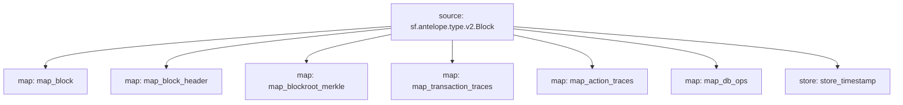

# Antelope `Common` Substream

> Antelope **action traces** & **database operations**.

## Mermaid graph



### Modules

```yaml
Package name: common
Version: v0.3.0
Doc: Antelope based action traces & database operations.
Modules:
----
Name: map_block
Initial block: 2
Kind: map
Output Type: proto:sf.antelope.type.v1.Block
Hash: 2a7d26088ad491f76e3339665178cf78396c022d

Name: map_block_header
Initial block: 2
Kind: map
Output Type: proto:sf.antelope.type.v1.BlockHeader
Hash: 77f43dd05cc7aec645929dd52848967e7a424dd4

Name: map_blockroot_merkle
Initial block: 2
Kind: map
Output Type: proto:sf.antelope.type.v1.BlockRootMerkle
Hash: 91f098a3e2a00c9339d9fa055b2cf2032af9f2cb

Name: map_transaction_traces
Initial block: 2
Kind: map
Output Type: proto:sf.antelope.type.v1.TransactionTraces
Hash: edb5f03c5353106adc0e71ededd37222e43c6e7e

Name: map_action_traces
Initial block: 2
Kind: map
Output Type: proto:sf.antelope.type.v1.ActionTraces
Hash: 5dc7caf51ccb43b0339fc6fb33dfe7b85d0af4b0

Name: map_db_ops
Initial block: 2
Kind: map
Output Type: proto:sf.antelope.type.v1.DBOps
Hash: fbbb656225dff3d41a1e6eec8609ffbf61f7f8b5

Name: store_timestamp
Initial block: 2
Kind: store
Value Type: int64
Update Policy: UPDATE_POLICY_SET
Hash: 5fe01de39c6da27ec8997d37d462b339a8dd4daa
```