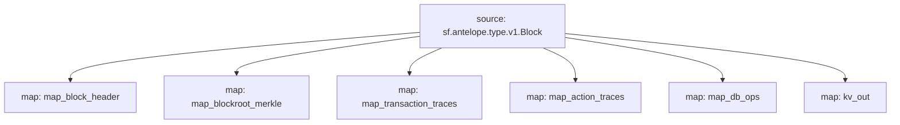

# Antelope `Common` Substream

> Antelope **action traces** & **database operations**.

### [Latest Releases](https://github.com/pinax-network/substreams/releases)

### Quickstart

```bash
$ make
$ make run
```

### KV

- `block.id:<block.number>`
- `block.timestamp:<block.number>`

## Mermaid graph



### Modules

```yaml
Package name: common
Version: v0.4.0
Doc: Antelope based action traces & database operations.
Modules:
----
Name: map_block_header
Initial block: 2
Kind: map
Output Type: proto:sf.antelope.type.v1.BlockHeader
Hash: a4eee3c6fc858a0a3405058fa274bed05edb545e

Name: map_blockroot_merkle
Initial block: 2
Kind: map
Output Type: proto:sf.antelope.type.v1.BlockRootMerkle
Hash: 4eaaf97298d358943598cb8c61d7cd8b106a0d59

Name: map_transaction_traces
Initial block: 2
Kind: map
Output Type: proto:sf.antelope.type.v1.TransactionTraces
Hash: 26040054e21d78bcfe0110bd80404cf721a86d93

Name: map_action_traces
Initial block: 2
Kind: map
Output Type: proto:sf.antelope.type.v1.ActionTraces
Hash: 511b5b43b716576f11515457cd671598fca471ee

Name: map_db_ops
Initial block: 2
Kind: map
Output Type: proto:sf.antelope.type.v1.DBOps
Hash: e2ad291a121935e8ff3fa58f53bf475b4a4cd4a5

Name: kv_out
Initial block: 0
Kind: map
Output Type: proto:sf.substreams.sink.kv.v1.KVOperations
Hash: 6f1ef3777bd995d8803baf4dbd2c4ca2a9958bfa
```