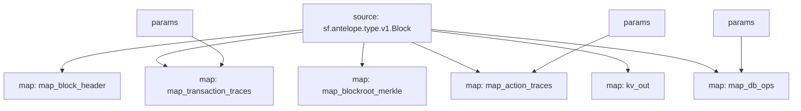

# Antelope `Common` Substream

> Antelope **action traces** & **database operations**.

### [Latest Releases](https://github.com/pinax-network/substreams/releases)

### Quickstart

```bash
$ make
$ make run
```

### KV

- `block.id:<block.number>`
- `block.timestamp:<block.number>`

### Params

Params allow to filter messages and can be supplied to modules in the form of URL query, i.e. `contract=eosio.token&action=transfer` - filter `eosio.token` contract `transfer` actions.

| module       | key        | description |
|--------------|------------|-------------|
| `map_transaction_traces` | `contract` | filter by contract(s)
| `map_transaction_traces` | `action`   | filter by action(s)
| `map_transaction_traces` | `receiver`   | filter by receiver(s)
| `map_action_traces` | `contract` | filter by contract(s)
| `map_action_traces` | `action`   | filter by action(s)
| `map_action_traces` | `receiver`   | filter by receiver(s)
| `map_db_ops` | `contract` | filter by contract(s)
| `map_db_ops` | `table`   | filter by action(s)

## Mermaid graph



### Modules

```yaml
Package name: common
Version: v0.5.0
Doc: Antelope based action traces & database operations.
Modules:
----
Name: map_block_header
Initial block: 2
Kind: map
Output Type: proto:sf.antelope.type.v1.BlockHeader
Hash: 28ee1f2bd5abdbf74cda9d2767f6928cbf178a35

Name: map_blockroot_merkle
Initial block: 2
Kind: map
Output Type: proto:sf.antelope.type.v1.BlockRootMerkle
Hash: 23107f7d53b6e80417bd36acb5c7fbd6020dd04f

Name: map_transaction_traces
Initial block: 2
Kind: map
Output Type: proto:sf.antelope.type.v1.TransactionTraces
Hash: cd6fb8422bbd0fc41819a63e9b473ecf76a3f478

Name: map_action_traces
Initial block: 2
Kind: map
Output Type: proto:sf.antelope.type.v1.ActionTraces
Hash: 6310c031f22b5e80f41123efad448f48f5a7f000

Name: map_db_ops
Initial block: 2
Kind: map
Output Type: proto:sf.antelope.type.v1.DBOps
Hash: 8a5340561fc532ebd52c7074d14c7b60fa7fffa1

Name: kv_out
Initial block: 0
Kind: map
Output Type: proto:sf.substreams.sink.kv.v1.KVOperations
Hash: f3a5dbde58ac99fbef4e6a1dd4eae0375073b56a
```