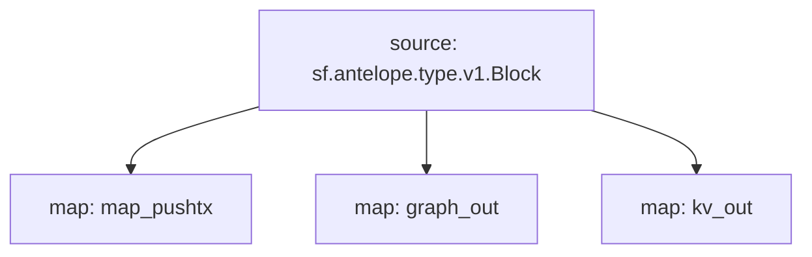

# Antelope `eosio.evm` Substream

> Antelope `eosio.evm` contract events

### [Latest Releases](https://github.com/pinax-network/substreams/releases)

### Quickstart

```bash
$ make
$ make gui        # all pushtx
```

### Mermaid graph



### Modules

```yaml
Package name: eosio_evm
Version: v0.0.1
Doc: Antelope `eosio.evm` contract.
Modules:
----
Name: map_pushtx
Initial block: 0
Kind: map
Output Type: proto:antelope.eosio.evm.v1.Pushtxs
Hash: b785f9b233b1959d2b3861ec7a7dd0cb0366e010

Name: graph_out
Initial block: 0
Kind: map
Output Type: proto:substreams.entity.v1.EntityChanges
Hash: cb09d798e8d66e53de474b5989bdc9ffb3a08310

Name: kv_out
Initial block: 0
Kind: map
Output Type: proto:sf.substreams.sink.kv.v1.KVOperations
Hash: b37ca6afa6fef5cbbc73e42885ff561d0f32c3df
```