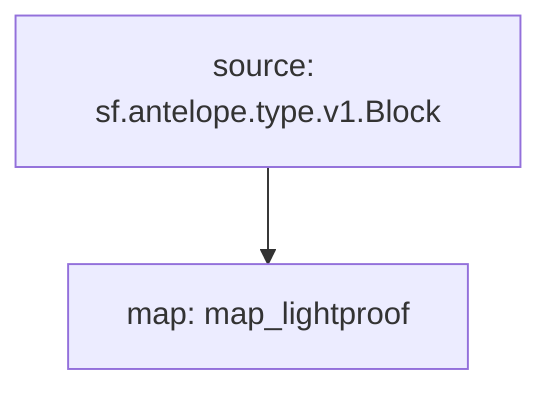

# Antelope `eosio.ibc` Substream

> Antelope `eosio.ibc` Lightproof **block** details.

### [Latest Releases](https://github.com/pinax-network/substreams/releases)

### Quickstart

```bash
$ make
$ make run
```

### Graph



### Modules

```yaml
Package name: eosio_ibc
Version: v0.1.0
Doc: Antelope `eosio.ibc` Lightproof **block** details.
Modules:
----
Name: map_lightproof
Initial block: 2
Kind: map
Output Type: proto:antelope.eosio.ibc.v1.Lightproof
Hash: 65ab2ad88a42ac035016b03b48a07308e829fe2d
```