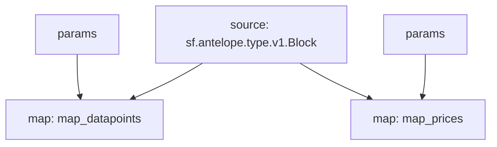

# Antelope Oracles Substream

> Antelope Oracles prices from [`delphioracle`](https://bloks.io/account/delphioracle) and [`oracle.defi`](https://bloks.io/account/oracle.defi)

### [Latest Releases](https://github.com/pinax-network/substreams/releases)

### Quickstart

```bash
$ make
$ make delphioracle # datapoints
$ make oracle_defi # prices
```

### Mermaid graph



### Modules

```yaml
Package name: eosio_oracles
Version: v0.0.4
Doc: Antelope `eosio.token` based action traces & database operations.
Modules:
----
Name: map_datapoints
Initial block: 0
Kind: map
Output Type: proto:antelope.eosio.oracles.v1.Datapoints
Hash: e9b08ff893182a651a14697e8b9aff395c804012

Name: map_prices
Initial block: 0
Kind: map
Output Type: proto:antelope.eosio.oracles.v1.Prices
Hash: 2491cc1d1f2750102a45a1010a0e5023709c7ace
```