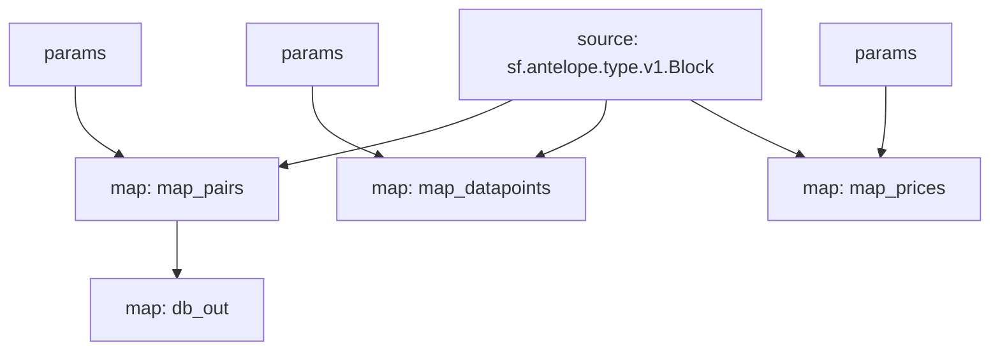

# Antelope Oracles Substream

> Antelope Oracles prices from [`delphioracle`](https://bloks.io/account/delphioracle) and [`oracle.defi`](https://bloks.io/account/oracle.defi)

### [Latest Releases](https://github.com/pinax-network/substreams/releases)

### Quickstart

```bash
$ make
$ make delphioracle # datapoints
$ make oracle_defi # prices
```

### Mermaid graph



### Modules

```yaml
Package name: eosio_oracles
Version: v0.0.2
Doc: Antelope `eosio.token` based action traces & database operations.
Modules:
----
Name: map_pairs
Initial block: 0
Kind: map
Output Type: proto:antelope.eosio.oracles.v1.Pairs
Hash: f598233dfdfbfb126910cc9b227e9482950c0a1c

Name: map_datapoints
Initial block: 0
Kind: map
Output Type: proto:antelope.eosio.oracles.v1.Datapoints
Hash: 892a5f9bf97c6ccce6fe617209b92c2a3de96879

Name: map_prices
Initial block: 0
Kind: map
Output Type: proto:antelope.eosio.oracles.v1.Prices
Hash: 7dcc8f9c9f184fc7b7764414a8bbc2d94e39ac7a

Name: db_out
Initial block: 0
Kind: map
Output Type: proto:sf.substreams.sink.database.v1.DatabaseChanges
Hash: 4f49a690c34a7635ca4c6d29ecd072f6476214f7
```