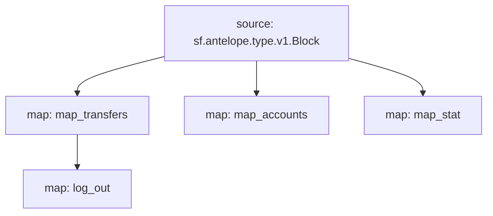

# Antelope `eosio.token` Substream

> Antelope `eosio.token` token transfers

### [Latest Releases](https://github.com/pinax-network/substreams/releases)

### Quickstart

```bash
$ make
$ make run
```

### Mermaid graph



### Modules

```yaml
Package name: eosio_token
Version: v0.4.1
Doc: Antelope `eosio.token` based action traces & database operations.
Modules:
----
Name: map_transfers
Initial block: 0
Kind: map
Output Type: proto:antelope.eosio.token.v1.TransferEvents
Hash: b10a4a6d64558e639a1f571f256fae2ddf5f4edf

Name: map_accounts
Initial block: 0
Kind: map
Output Type: proto:antelope.eosio.token.v1.Accounts
Hash: cce87730d9af37f64afa65d6fa706c7fe121b680

Name: map_stat
Initial block: 0
Kind: map
Output Type: proto:antelope.eosio.token.v1.Stats
Hash: da0cf92815bce9889ea89e54dd636b7e11f3c9d2

Name: log_out
Initial block: 0
Kind: map
Output Type: proto:pinax.substreams.sink.winston.v1.LoggerOperations
Hash: 159780ff24f2b1b00dd7001bfe54726382e1be96
```