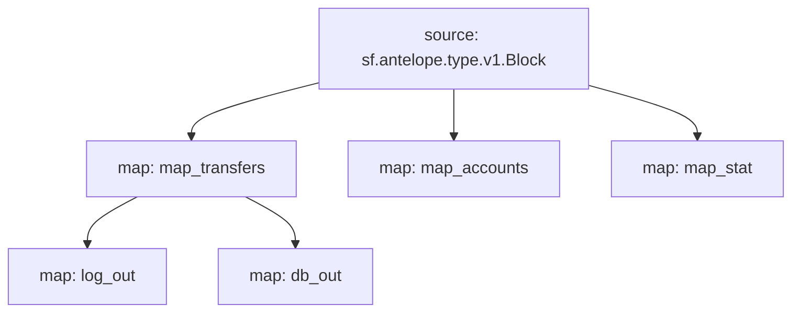

# Antelope `eosio.token` Substream

> Antelope `eosio.token` token transfers

### [Latest Releases](https://github.com/pinax-network/substreams/releases)

### Quickstart

```bash
$ make
$ make gui
```

### Mermaid graph



### Modules

```yaml
Package name: eosio_token
Version: v0.5.0
Doc: Antelope `eosio.token` based action traces & database operations.
Modules:
----
Name: map_transfers
Initial block: 0
Kind: map
Output Type: proto:antelope.eosio.token.v1.TransferEvents
Hash: 5b2c65e956866a100603b90c3ec7d942fb0f2420

Name: map_accounts
Initial block: 0
Kind: map
Output Type: proto:antelope.eosio.token.v1.Accounts
Hash: 6e213a53383aeba7003aee28656f357873cdb4ba

Name: map_stat
Initial block: 0
Kind: map
Output Type: proto:antelope.eosio.token.v1.Stats
Hash: 2045e91f250d51ec3194896c493b37e547824852

Name: log_out
Initial block: 0
Kind: map
Output Type: proto:pinax.substreams.sink.winston.v1.LoggerOperations
Hash: 8231e3c662273469a332897c2c7f88952b449fb1

Name: db_out
Initial block: 0
Kind: map
Output Type: proto:sf.substreams.sink.database.v1.DatabaseChanges
Hash: 7484b30b46c532749936988d1826f4f5001447d6
```