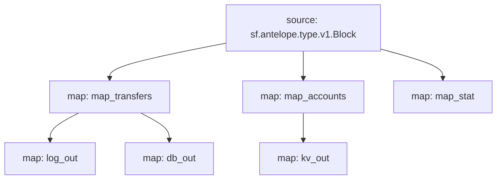

# Antelope `eosio.token` Substream

> Antelope `eosio.token` token transfers

### [Latest Releases](https://github.com/pinax-network/substreams/releases)

### Quickstart

```bash
$ make
$ make run
```

### Mermaid graph



### Modules

```yaml
Package name: eosio_token
Version: v0.4.3
Doc: Antelope `eosio.token` based action traces & database operations.
Modules:
----
Name: map_transfers
Initial block: 0
Kind: map
Output Type: proto:antelope.eosio.token.v1.TransferEvents
Hash: 752b3fe833d102e98e2254369054d4cb69b66867

Name: map_accounts
Initial block: 0
Kind: map
Output Type: proto:antelope.eosio.token.v1.Accounts
Hash: 037bd1eddaaa3e310f2712ad77ec1472a24df01d

Name: map_stat
Initial block: 0
Kind: map
Output Type: proto:antelope.eosio.token.v1.Stats
Hash: f19b142d4c49d5f6bab6614d423ad3b8c816f9f6

Name: log_out
Initial block: 0
Kind: map
Output Type: proto:pinax.substreams.sink.winston.v1.LoggerOperations
Hash: b379875f965096967ac2703995e0a914891193d7

Name: db_out
Initial block: 0
Kind: map
Output Type: proto:sf.substreams.sink.database.v1.DatabaseChanges
Hash: c7957a95810ac00e513fb8062438ab9d82aa4bba

Name: kv_out
Initial block: 0
Kind: map
Output Type: proto:sf.substreams.sink.kv.v1.KVOperations
Hash: 49910fd31c6100410768157d52f7a14cac08f5ec
```