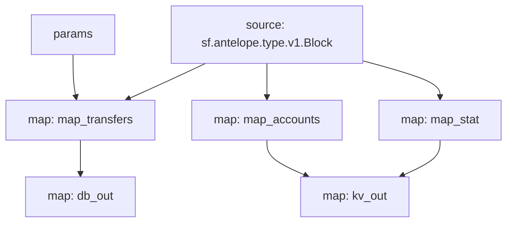

# Antelope `eosio.token` Substream

> Antelope `eosio.token` token transfers with params

### [Latest Releases](https://github.com/pinax-network/substreams/releases)


### Params
Params allow to filter messages and can be supplied to modules in the form of URL query, i.e. `to=swap.defi&contract=eosio.token` - filter EOS transfers to `swap.defi` account
- `map_transfers` - filter transfers
  - `to` - receiver
  - `from` - sender
  - `symcode` - symbol code
  - `contract` - token contract
  - `to_or_from` - either receiver or sender
- `map_accounts` - filter account balance changes
  - `account` - account
  - `symcode` - symbol code
  - `contract` - token contract
- `map_stat` - filter token stats
  - `symcode` - symbol code
  - `contract` - token contract

### Quickstart

```bash
$ make
$ make gui        # all transfers
$ make param      # swap.defi transfers
```

### Mermaid graph



### Modules

```yaml
Package name: eosio_token
Version: v0.9.0
Doc: Antelope `eosio.token` based action traces & database operations.
Modules:
----
Name: map_transfers
Initial block: 0
Kind: map
Output Type: proto:antelope.eosio.token.v1.TransferEvents
Hash: e832d395d7c4ad888f045ffe08fd3fa6952b5598

Name: map_accounts
Initial block: 0
Kind: map
Output Type: proto:antelope.eosio.token.v1.Accounts
Hash: 92884539c7ceb7107b48965b48da26fabd6b96a5

Name: map_stat
Initial block: 0
Kind: map
Output Type: proto:antelope.eosio.token.v1.Stats
Hash: 61356dd96ff90b2f8bc32c28e1e6e57c268c0175

Name: db_out
Initial block: 0
Kind: map
Output Type: proto:sf.substreams.sink.database.v1.DatabaseChanges
Hash: a63bf736a39ac384ef038d92961ade52b90c5908

Name: kv_out
Initial block: 0
Kind: map
Output Type: proto:sf.substreams.sink.kv.v1.KVOperations
Hash: 785658f5d1ffc6857196a7e1619ba138f46afd3e
```