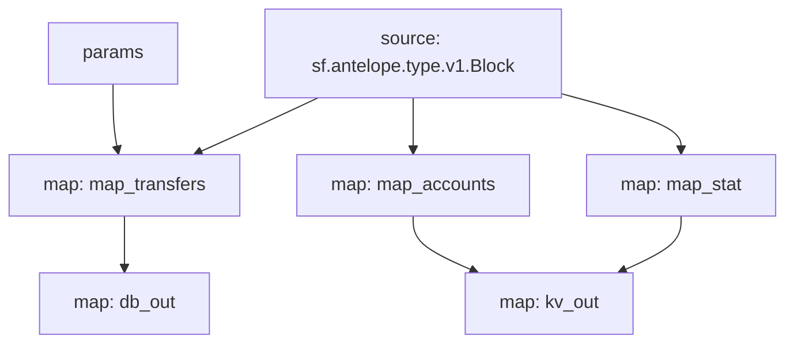

# Antelope `eosio.token` Substream

> Antelope `eosio.token` token transfers with params

### [Latest Releases](https://github.com/pinax-network/substreams/releases)

### Quickstart

```bash
$ make
$ make gui        # all transfers
$ make param      # swap.defi transfers
```

### Mermaid graph



### Modules

```yaml
Package name: eosio_token
Version: v0.8.1
Doc: Antelope `eosio.token` based action traces & database operations.
Modules:
----
Name: map_transfers
Initial block: 0
Kind: map
Output Type: proto:antelope.eosio.token.v1.TransferEvents
Hash: 9709be9b7bcfa5d7026187d356900bcefba7bcec

Name: map_accounts
Initial block: 0
Kind: map
Output Type: proto:antelope.eosio.token.v1.Accounts
Hash: 9235d38296f953ebba46ce9426fc978bf7d62626

Name: map_stat
Initial block: 0
Kind: map
Output Type: proto:antelope.eosio.token.v1.Stats
Hash: 21f1030a86f5a4ceaf4377d86e7a9f35cb51464f

Name: db_out
Initial block: 0
Kind: map
Output Type: proto:sf.substreams.sink.database.v1.DatabaseChanges
Hash: c830d5c825f125dfc92c720d73059a47698aaef2

Name: kv_out
Initial block: 0
Kind: map
Output Type: proto:sf.substreams.sink.kv.v1.KVOperations
Hash: d2a5746797ae42a9ebd31607c4068b7f504f4cfe
```