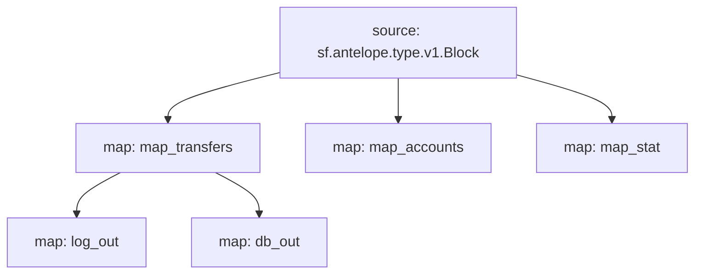

# Antelope `eosio.token` Substream

> Antelope `eosio.token` token transfers

### [Latest Releases](https://github.com/pinax-network/substreams/releases)

### Quickstart

```bash
$ make
$ make run
```

### Mermaid graph



### Modules

```yaml
Package name: eosio_token
Version: v0.4.2
Doc: Antelope `eosio.token` based action traces & database operations.
Modules:
----
Name: map_transfers
Initial block: 0
Kind: map
Output Type: proto:antelope.eosio.token.v1.TransferEvents
Hash: 3bf80ccd75e75c9769569c61072df71c759d0837

Name: map_accounts
Initial block: 0
Kind: map
Output Type: proto:antelope.eosio.token.v1.Accounts
Hash: 23fb29a4da7fccd0b050cdbeb9444ab21d1778f5

Name: map_stat
Initial block: 0
Kind: map
Output Type: proto:antelope.eosio.token.v1.Stats
Hash: 0c872e759c25f039c40b6012f35e7ad9315c3ce6

Name: log_out
Initial block: 0
Kind: map
Output Type: proto:pinax.substreams.sink.winston.v1.LoggerOperations
Hash: 54088d32a300dc7966321f4f49db4fef3da730d8

Name: db_out
Initial block: 0
Kind: map
Output Type: proto:sf.substreams.database.v1.DatabaseChanges
Hash: 7f9bad0c12abbf83719b020648c739621eb48312
```