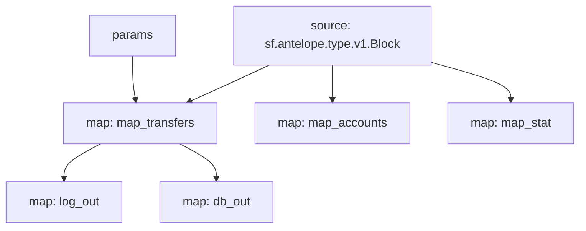

# Antelope `eosio.token` Substream

> Antelope `eosio.token` token transfers with params

### [Latest Releases](https://github.com/pinax-network/substreams/releases)

### Quickstart

```bash
$ make
$ make gui        # all transfers
$ make param      # swap.defi transfers
```

### Mermaid graph



### Modules

```yaml
Package name: eosio_token
Version: v0.6.0
Doc: Antelope `eosio.token` based action traces & database operations.
Modules:
----
Name: map_transfers
Initial block: 0
Kind: map
Output Type: proto:antelope.eosio.token.v1.TransferEvents
Hash: 0cba42785a0dc041107d4f021e165259747b7d0f

Name: map_accounts
Initial block: 0
Kind: map
Output Type: proto:antelope.eosio.token.v1.Accounts
Hash: 66ea805755a39635a98299c1219bec20133f51b1

Name: map_stat
Initial block: 0
Kind: map
Output Type: proto:antelope.eosio.token.v1.Stats
Hash: 3ae8f88517621a94d065f13abace888807ea83c0

Name: log_out
Initial block: 0
Kind: map
Output Type: proto:pinax.substreams.sink.winston.v1.LoggerOperations
Hash: e189a05b1e3073ca61d1fb2333957a44b6f43ae9

Name: db_out
Initial block: 0
Kind: map
Output Type: proto:sf.substreams.sink.database.v1.DatabaseChanges
Hash: 45e3910793165168d1087f51258e2389807be9a0
```