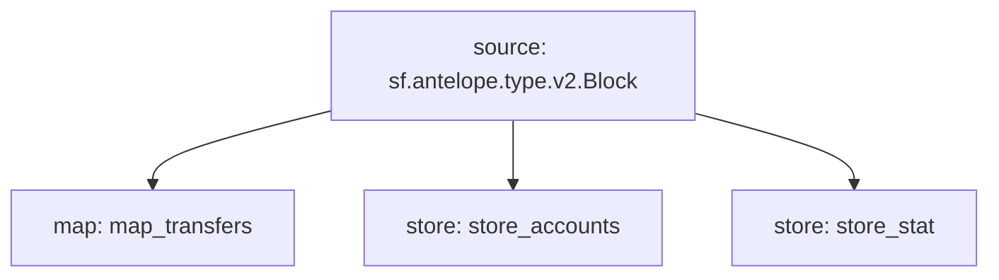

# Antelope `eosio.token` Substream

> Antelope `eosio.token` based **action traces** & **database operations**.

### Mermaid graph



### Modules

```yaml
Package name: eosio_token
Version: v0.4.0
Doc: Antelope `eosio.token` based action traces & database operations.
Modules:
----
Name: map_transfers
Initial block: 0
Kind: map
Output Type: proto:antelope.eosio.token.v1.TransferEvents
Hash: 1ea4eb006b21562d1de2a4f792094245503fbf0c

Name: store_accounts
Initial block: 2
Kind: store
Value Type: proto:antelope.eosio.token.v1.Account
Update Policy: UPDATE_POLICY_SET
Hash: 6d6755517f205c72fa4eb8588154dfe2a5cfd897

Name: store_stat
Initial block: 2
Kind: store
Value Type: proto:antelope.eosio.token.v1.CurrencyStats
Update Policy: UPDATE_POLICY_SET
Hash: a7ebd372cdb44c30b0066b200bd861654e67e924
```