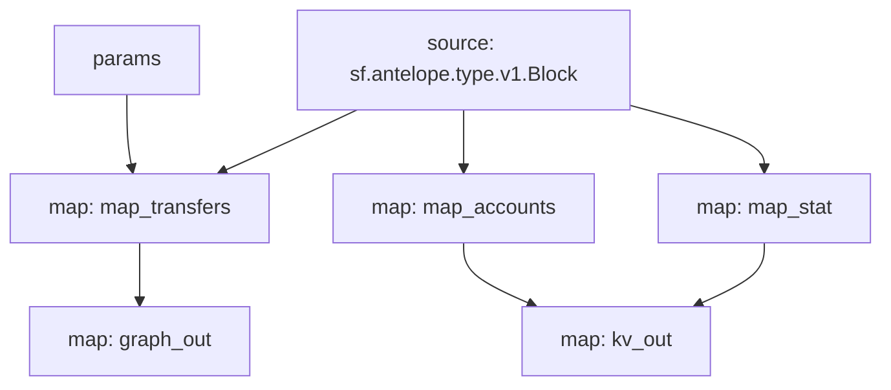

# Antelope `eosio.token` Substream

> Antelope `eosio.token` token transfers with params

### [Latest Releases](https://github.com/pinax-network/substreams/releases)


### Params
Params allow to filter messages and can be supplied to modules in the form of URL query, i.e. `to=swap.defi&contract=eosio.token` - filter EOS transfers to `swap.defi` account
- `map_transfers` - filter transfers
  - `to` - receiver
  - `from` - sender
  - `symcode` - symbol code
  - `contract` - token contract
  - `to_or_from` - either receiver or sender
- `map_accounts` - filter account balance changes
  - `account` - account
  - `symcode` - symbol code
  - `contract` - token contract
- `map_stat` - filter token stats
  - `symcode` - symbol code
  - `contract` - token contract

### Quickstart

```bash
$ make
$ make gui        # all transfers
$ make param      # swap.defi transfers
```

### Mermaid graph



### Modules

```yaml
Package name: eosio_token
Version: v0.10.0
Doc: Antelope `eosio.token` based action traces & database operations.
Modules:
----
Name: map_transfers
Initial block: 0
Kind: map
Output Type: proto:antelope.eosio.token.v1.TransferEvents
Hash: d331e4b9f5d02495638bd6e8caa638a6a8e56740

Name: map_accounts
Initial block: 0
Kind: map
Output Type: proto:antelope.eosio.token.v1.Accounts
Hash: b75af7789f4a7055b166c9ca61deca146f4ef23e

Name: map_stat
Initial block: 0
Kind: map
Output Type: proto:antelope.eosio.token.v1.Stats
Hash: 1adb9207a8728f7707ee6a70541c6525ba8c1b64

Name: graph_out
Initial block: 0
Kind: map
Output Type: proto:substreams.entity.v1.EntityChanges
Hash: 10fe3d0d70d4794af36a03cd67d55a428e40f21d

Name: kv_out
Initial block: 0
Kind: map
Output Type: proto:sf.substreams.sink.kv.v1.KVOperations
Hash: f0e646700ff89e5eb89e5708a4c63685ef5fad9e
```