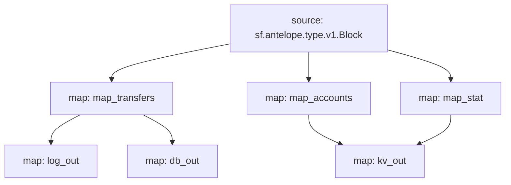

# Antelope `eosio.token` Substream

> Antelope `eosio.token` token transfers

### [Latest Releases](https://github.com/pinax-network/substreams/releases)

### Quickstart

```bash
$ make
$ make run
```

### Mermaid graph



### Modules

```yaml
Package name: eosio_token
Version: v0.4.3
Doc: Antelope `eosio.token` based action traces & database operations.
Modules:
----
Name: map_transfers
Initial block: 0
Kind: map
Output Type: proto:antelope.eosio.token.v1.TransferEvents
Hash: fb506f775bc26e4b712e88b7114d8707fb293c77

Name: map_accounts
Initial block: 0
Kind: map
Output Type: proto:antelope.eosio.token.v1.Accounts
Hash: e8ef91e0d9e5fc3d0d0f783e0061d8b681998f76

Name: map_stat
Initial block: 0
Kind: map
Output Type: proto:antelope.eosio.token.v1.Stats
Hash: c3b29d315f8b7c241863c049c28411cb15f42191

Name: log_out
Initial block: 0
Kind: map
Output Type: proto:pinax.substreams.sink.winston.v1.LoggerOperations
Hash: d45c04ae8efb844708292b5ed4309dd52bf1f85b

Name: db_out
Initial block: 0
Kind: map
Output Type: proto:sf.substreams.sink.database.v1.DatabaseChanges
Hash: d006c72bdb50e27e9f14ebfbaae9c99d8a132400

Name: kv_out
Initial block: 0
Kind: map
Output Type: proto:sf.substreams.sink.kv.v1.KVOperations
Hash: e5edb476b4cd46b756be5d146646070d0a12b95e
```