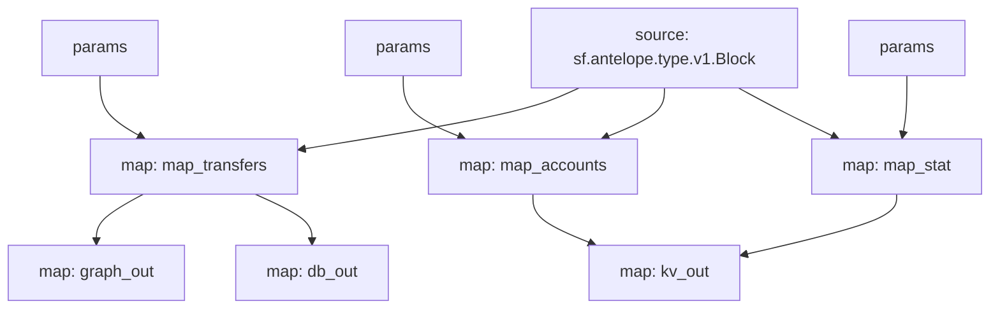

# Antelope `eosio.token` Substream

> Antelope `eosio.token` token transfers with params

### [Latest Releases](https://github.com/pinax-network/substreams/releases)


### Params
Params allow to filter messages and can be supplied to modules in the form of URL query.

> i.e. `to=swap.defi&contract=eosio.token&symcode=EOS` - filters EOS transfers to `swap.defi` account.

- `map_transfers` - filter transfers
  - `to` - receiver
  - `from` - sender
  - `symcode` - symbol code
  - `contract` - token contract
  - `to_or_from` - either receiver or sender
  - `quantity_lt` - quantity amount **less than**
  - `quantity_lte` - quantity amount **less than or equal to**
  - `quantity_gt` - quantity amount **greater than**
  - `quantity_gte` - quantity amount **greater than or equal to**
- `map_accounts` - filter account balance changes
  - `account` - account
  - `symcode` - symbol code
  - `contract` - token contract
  - `balance_lt` - balance amount **less than**
  - `balance_lte` - balance amount **less than or equal to**
  - `balance_gt` - balance amount **greater than**
  - `balance_gte` - balance amount **greater than or equal to**
  - `balance_delta_lt` - balance delta amount **less than**
  - `balance_delta_lte` - balance delta amount **less than or equal to**
  - `balance_delta_gt` - balance delta amount **greater than**
  - `balance_delta_gte` - balance delta amount **greater than or equal to**
- `map_stat` - filter token stats
  - `symcode` - symbol code
  - `contract` - token contract
  - `supply_lt` - supply amount **less than**
  - `supply_lte` - supply amount **less than or equal to**
  - `supply_gt` - supply amount **greater than**
  - `supply_gte` - supply amount **greater than or equal to**
  - `supply_delta_lt` - supply delta amount **less than**
  - `supply_delta_lte` - supply delta amount **less than or equal to**
  - `supply_delta_gt` - supply delta amount **greater than**
  - `supply_delta_gte` - supply delta amount **greater than or equal to**

### Quickstart

```bash
$ make
$ make gui        # all transfers
$ make param      # swap.defi transfers
```

### Mermaid graph



### Modules

```yaml
Package name: eosio_token
Version: v0.12.0
Doc: Antelope `eosio.token` based action traces & database operations.
Modules:
----
Name: map_transfers
Initial block: 0
Kind: map
Output Type: proto:antelope.eosio.token.v1.TransferEvents
Hash: c2ddeec2dba7004b4a3d44fb1ee9f2e8f995de10

Name: map_accounts
Initial block: 0
Kind: map
Output Type: proto:antelope.eosio.token.v1.Accounts
Hash: 4c9b69a46775b3cb48f516bf97d2e4e62e2050a7

Name: map_stat
Initial block: 0
Kind: map
Output Type: proto:antelope.eosio.token.v1.Stats
Hash: 72f9694a2ec4c9f92bdaa52ffae5be3615549e1a

Name: graph_out
Initial block: 0
Kind: map
Output Type: proto:substreams.entity.v1.EntityChanges
Hash: 9f6bb5e02d226a92ea288396c6d65c4bafe8e916

Name: kv_out
Initial block: 0
Kind: map
Output Type: proto:sf.substreams.sink.kv.v1.KVOperations
Hash: 4a80a82300d3ca63fe9183e3fbbf84ef21f184cb

Name: db_out
Initial block: 0
Kind: map
Output Type: proto:sf.substreams.sink.database.v1.DatabaseChanges
Hash: 062e8bdda04d569a44bdd14c7bcc2308f37529fc
```