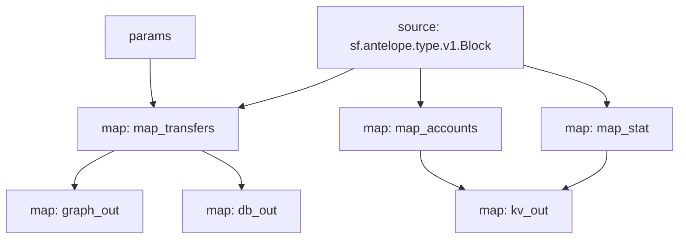

# Antelope `eosio.token` Substream

> Antelope `eosio.token` token transfers with params

### [Latest Releases](https://github.com/pinax-network/substreams/releases)


### Params
Params allow to filter messages and can be supplied to modules in the form of URL query, i.e. `to=swap.defi&contract=eosio.token` - filter EOS transfers to `swap.defi` account
- `map_transfers` - filter transfers
  - `to` - receiver
  - `from` - sender
  - `symcode` - symbol code
  - `contract` - token contract
  - `to_or_from` - either receiver or sender
- `map_accounts` - filter account balance changes
  - `account` - account
  - `symcode` - symbol code
  - `contract` - token contract
- `map_stat` - filter token stats
  - `symcode` - symbol code
  - `contract` - token contract

### Quickstart

```bash
$ make
$ make gui        # all transfers
$ make param      # swap.defi transfers
```

### Mermaid graph



### Modules

```yaml
Package name: eosio_token
Version: v0.11.0
Doc: Antelope `eosio.token` based action traces & database operations.
Modules:
----
Name: map_transfers
Initial block: 0
Kind: map
Output Type: proto:antelope.eosio.token.v1.TransferEvents
Hash: 0a39637b4c8c5fb2300e3bbb0655a27de5ef78a0

Name: map_accounts
Initial block: 0
Kind: map
Output Type: proto:antelope.eosio.token.v1.Accounts
Hash: 3a648fbb9db0b4f330c9b97d096d1e63744ff32c

Name: map_stat
Initial block: 0
Kind: map
Output Type: proto:antelope.eosio.token.v1.Stats
Hash: 1f06ed9106b5e7990d4e413005721852d2360e68

Name: graph_out
Initial block: 0
Kind: map
Output Type: proto:substreams.entity.v1.EntityChanges
Hash: bb6878235c0ee77321f286e5b2369d0696af4e87

Name: kv_out
Initial block: 0
Kind: map
Output Type: proto:sf.substreams.sink.kv.v1.KVOperations
Hash: 38fb1424d9f845367babb424f3fab910f1fecbe4

Name: db_out
Initial block: 0
Kind: map
Output Type: proto:sf.substreams.sink.database.v1.DatabaseChanges
Hash: 1ba842ba4d4b861dbdbf973729e08852a2e73c61
```