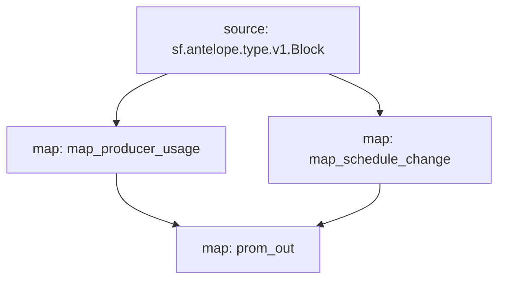

# Antelope `eosmechanics` Substream

> Block Producer Benchmarks created by [AlohaEOS](https://www.alohaeos.com/tools/benchmarks).

### [Latest Releases](https://github.com/pinax-network/substreams/releases)

### Quickstart

```bash
$ make
$ make run
$ make sink
```

### Sinks
- [Prometheus](https://github.com/pinax-network/substreams-sink-prometheus.rs)

### Mermaid graph




### Modules

```yaml
Package name: eosmechanics
Version: v0.3.5
Doc: Block Producer Benchmarks
Modules:
----
Name: map_producer_usage
Initial block: 0
Kind: map
Output Type: proto:eosmechanics.v1.ProducerUsage
Hash: 79d347ce956757310bebc0cde1bed9606edab871

Name: map_schedule_change
Initial block: 0
Kind: map
Output Type: proto:eosmechanics.v1.ScheduleChange
Hash: bd732c1b9c0755ebb848c9adac8dd7ebb030e3c5

Name: prom_out
Initial block: 0
Kind: map
Output Type: proto:pinax.substreams.sink.prometheus.v1.PrometheusOperations
Hash: 086515ddb61488e7feeb2763dc20e0868eeac32b
```