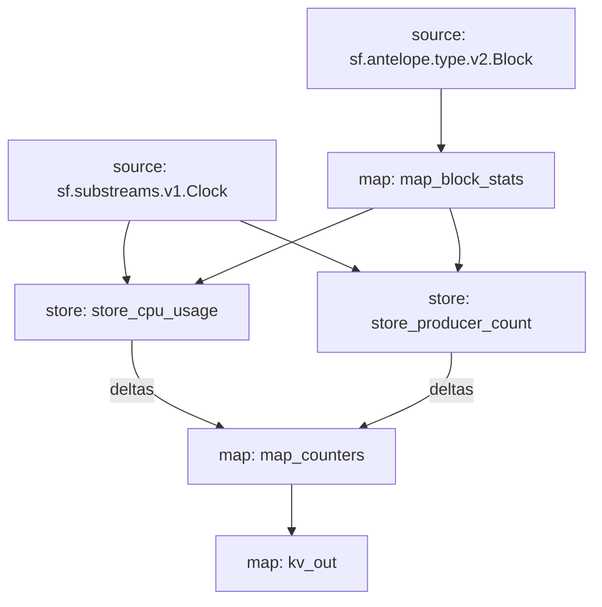

# Antelope `eosmechanics` Substream

> Block Producer Benchmarks

### Mermaid graph



### Modules

```yaml
Package name: eosmechanics
Version: v0.1.0
Doc: Block Producer Benchmarks
Modules:
----
Name: map_block_stats
Initial block: 0
Kind: map
Output Type: proto:eosmechanics.v1.BlockStats
Hash: 838ad79d031fe613d9f1c02af6c0471eef02c5c0

Name: store_cpu_usage
Initial block: 0
Kind: store
Value Type: int64
Update Policy: UPDATE_POLICY_ADD
Hash: e8933f08c82b181852c0a466f9b69491f2a40171

Name: store_producer_count
Initial block: 0
Kind: store
Value Type: int64
Update Policy: UPDATE_POLICY_ADD
Hash: bb16b6f2df1b3f4ae4c76779255264cb8d88f7d1

Name: map_counters
Initial block: 0
Kind: map
Output Type: proto:eosmechanics.v1.KeyValues
Hash: dd134e79de51fb1820231d53de3594ed03d83428

Name: kv_out
Initial block: 0
Kind: map
Output Type: proto:sf.substreams.kv.v1.KVOperations
Hash: 169b8f348c0bd57e3e337d7bf0d19ff202855fd0
```