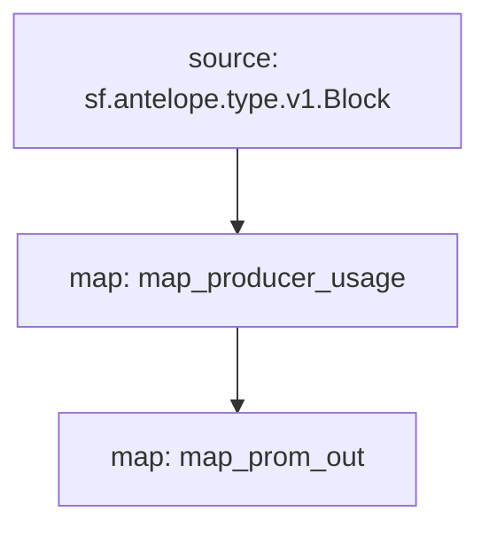

# Antelope `eosmechanics` Substream

> Block Producer Benchmarks created by [AlohaEOS](https://www.alohaeos.com/tools/benchmarks).

### Quickstart - **Substreams**

```
$ substreams run -e eos.firehose.eosnation.io:9001 map_producer_usage -s 292103130 -t +100000 -o jsonl
```

### Quickstart - **Prometheus**

1. Start streaming: `$ npm run start`
2. Open the browser at [http://localhost:9102/metrics](http://localhost:9102/metrics)

### Mermaid graph




### Modules

```yaml
Package name: eosmechanics
Version: v0.1.0
Doc: Block Producer Benchmarks
Modules:
----
Name: map_producer_usage
Initial block: 13389550
Kind: map
Output Type: proto:eosmechanics.v1.ProducerUsage
Hash: ce1c6cd1b8fb5eb6a75e2d0caed00897b673bf7b

Name: map_prom_out
Initial block: 13389550
Kind: map
Output Type: proto:pinax.substreams.sink.prom.v1.PrometheusMetrics
Hash: c57a5a1cafa2f0666675ad205aae1dc62685fd4b
```