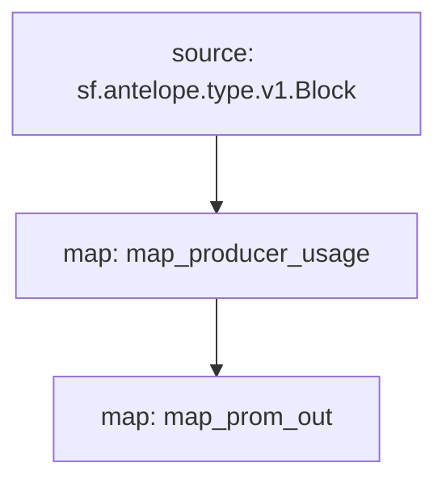

# Antelope `eosmechanics` Substream

> Block Producer Benchmarks created by [AlohaEOS](https://www.alohaeos.com/tools/benchmarks).

### Quickstart

```bash
$ substreams gui -e eos.firehose.eosnation.io:9001 https://github.com/pinax-network/substreams/releases/download/eosmechanics-v0.2.0/eosmechanics-v0.2.0.spkg map_producer_usage -s 292103130 -t +100000
```

### Build, Run & Sink from source

```bash
$ make
$ make run
$ make sink
```

### **Prometheus** Sink

1. Start streaming: `$ npm start`
2. Open the browser at [http://localhost:9102/metrics](http://localhost:9102/metrics)

### Mermaid graph




### Modules

```yaml
Package name: eosmechanics
Version: v0.2.0
Doc: Block Producer Benchmarks
Modules:
----
Name: map_producer_usage
Initial block: 0
Kind: map
Output Type: proto:eosmechanics.v1.ProducerUsage
Hash: 6fe6bd0b1c9aebbcf892bec8bf83866900b4e596

Name: map_schedule_change
Initial block: 0
Kind: map
Output Type: proto:eosmechanics.v1.ScheduleChange
Hash: 585523d4d14c8c6e59d3ca1f0a98e0aeed78babe

Name: prom_out
Initial block: 0
Kind: map
Output Type: proto:pinax.substreams.sink.prometheus.v1.PrometheusOperations
Hash: 56c7791c141bae56aada771237f404c9c253db82
```