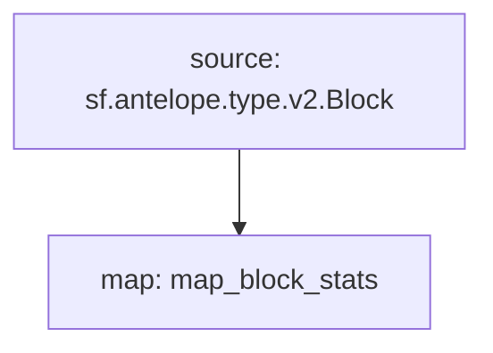

# Antelope `eosmechanics` Substream

> Block Producer Benchmarks created by [AlohaEOS](https://www.alohaeos.com/tools/benchmarks).

### Quickstart

```
$ substreams run -e eos.firehose.eosnation.io:9001 map_block_stats -t +10
```

### Mermaid graph




### Modules

```yaml
Package name: eosmechanics
Version: v0.1.0
Doc: Block Producer Benchmarks
Modules:
  ----
Name: map_block_stats
Initial block: 0
Kind: map
Output Type: proto:eosmechanics.v1.BlockStats
Hash: e71870fcf747d120a130501211e1ad8770cc44b8
```