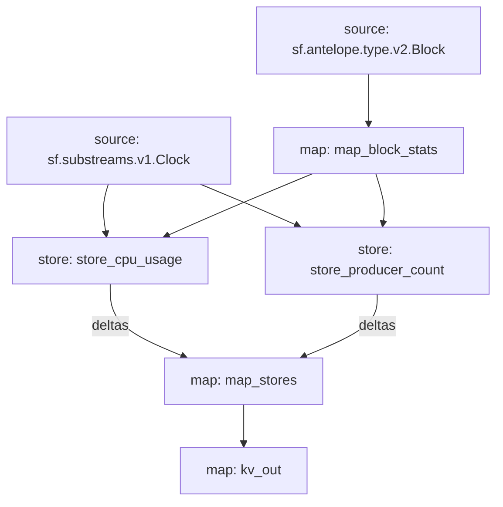

# Antelope `eosmechanics` Substream

> Block Producer Benchmarks created by [AlohaEOS](https://www.alohaeos.com/tools/benchmarks).


### Quickstart

```
$ substreams run -e eos.firehose.eosnation.io:9001 map_stores -t +10
```

### Mermaid graph



### Modules

```yaml
Package name: eosmechanics
Version: v0.1.0
Doc: Block Producer Benchmarks
Modules:
----
Name: map_block_stats
Initial block: 0
Kind: map
Output Type: proto:eosmechanics.v1.BlockStats
Hash: fe4dd2898771d0c0abd70426cdd2d4f8fc7166e9

Name: store_cpu_usage
Initial block: 0
Kind: store
Value Type: int64
Update Policy: UPDATE_POLICY_ADD
Hash: fdf23c7b1aaf2a3f27fc4ddaaf2affeca888845c

Name: store_producer_count
Initial block: 0
Kind: store
Value Type: int64
Update Policy: UPDATE_POLICY_ADD
Hash: 95aa1738876491945e99fb8e6ac884d354c5f6fe

Name: map_stores
Initial block: 0
Kind: map
Output Type: proto:eosmechanics.v1.KeyValues
Hash: 4a1d2fb53a0467b4b29456f7e39c3f0226936627

Name: kv_out
Initial block: 0
Kind: map
Output Type: proto:sf.substreams.kv.v1.KVOperations
Hash: 6ea4ef2311bbceea8735f59c3b4758157ff938e9
```