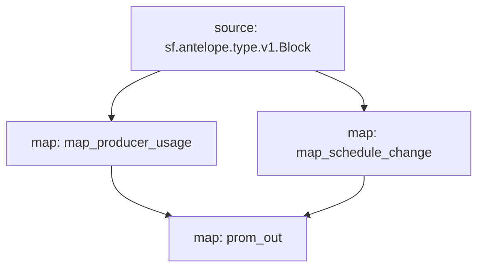

# Antelope `eosmechanics` Substream

> Block Producer Benchmarks created by [AlohaEOS](https://www.alohaeos.com/tools/benchmarks).

### [Latest Releases](https://github.com/pinax-network/substreams/releases)

### Quickstart

```bash
$ make
$ make run
$ make sink
```

### **Prometheus** Sink

1. Install `npm install -g substreams-sink-prometheus`
2. Run Sink `substreams-sink-prometheus run [<manifest>] [<module_name>] [flags]`
3. Open the browser at [http://localhost:9102/metrics](http://localhost:9102/metrics)

### Mermaid graph




### Modules

```yaml
Package name: eosmechanics
Version: v0.3.1
Doc: Block Producer Benchmarks
Modules:
----
Name: map_producer_usage
Initial block: 0
Kind: map
Output Type: proto:eosmechanics.v1.ProducerUsage
Hash: 3b54ddcfa9fae5d9a0d8eb85bb3d98b13f406f95

Name: map_schedule_change
Initial block: 0
Kind: map
Output Type: proto:eosmechanics.v1.ScheduleChange
Hash: c3b2a001069f03a9d688a13ab9a2ac4e83bec57f

Name: prom_out
Initial block: 0
Kind: map
Output Type: proto:pinax.substreams.sink.prometheus.v1.PrometheusOperations
Hash: 5d9aa31b7cd01a44baacf0a327c474df517430a6
```