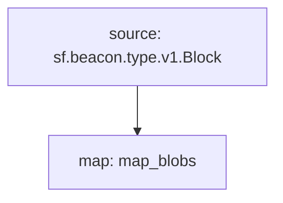

# Ethereum Beacon chain Blobs Substream

### [Latest Releases](https://github.com/pinax-network/substreams/releases)

### Quickstart

```bash
$ make gui
```

or

```bash
$ substreams gui -e goerli-scdm37b.mar.eosn.io:10016 https://github.com/pinax-network/substreams/releases/download/blobs-v0.2.0/eth-blobs-v0.2.0.spkg map_blobs -s -100 --plaintext
```

### Graph



### Modules

```yaml
Package name: eth_blobs
Version: v0.2.0
Modules:
----
Name: map_blobs
Initial block: 0
Kind: map
Input: source: sf.beacon.type.v1.Block
Output Type: proto:eth.blobs.v1.Blobs
Hash: ca9133543d1628df5681107b2ea68c4ade81cd8f
```