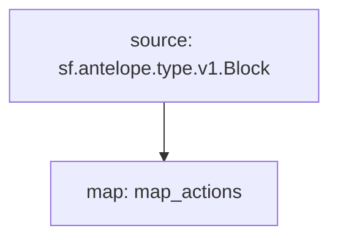

# Pomelo Bounties Substreams

> Pomelo Bounties Substreams

### [Latest Releases](https://github.com/pinax-network/substreams/releases)


### Quickstart

```bash
$ make
$ make gui
```

### Graph


### Modules

```yaml
Package name: pomelo_bounties
Version: v0.1.0
Doc: Antelope pomelo bounties updates
Modules:
----
Name: map_actions
Initial block: 0
Kind: map
Output Type: proto:antelope.pomelo.bounties.v1.Actions
Hash: b0a9a8e18943576081a652ef516475b97d8d2324
```