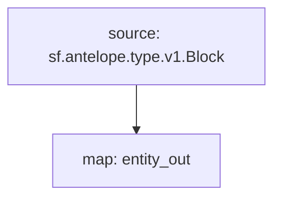

# Antelope Pomelo Substreams

> Antelope Pomelo Substreams

### [Latest Releases](https://github.com/pinax-network/substreams/releases)

### Sinks
- Socials (stay tuned)

### Quickstart

```bash
$ make
$ make gui
```

### Graph



### Modules

```yaml
Package name: pomelo
Version: v0.1.0
Doc: Antelope pomelo updates
Modules:
----
Name: entity_out
Initial block: 0
Kind: map
Output Type: proto:substreams.entity.v1.EntityChanges
Hash: 04d8aeae95d104cdeda26c31994ff2f2e67e7392
```