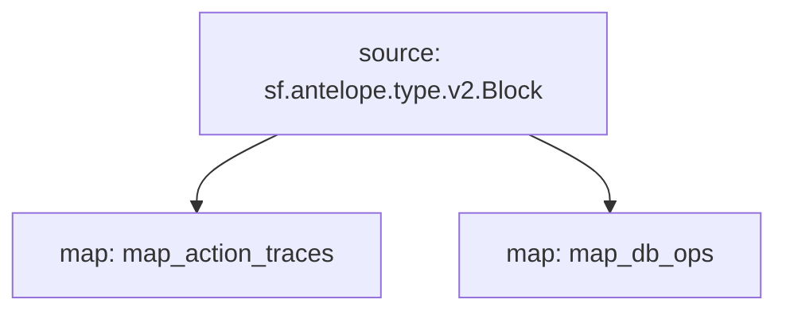

# Antelope `Common` Substream

> Antelope **action traces** & **database operations**.

## Mermaid graph



### Substream

| Name                | Version     | IPFS hash |
|---------------------|-------------|-----------|
| `common.spkg`       | **v0.2.0**  | `QmfE7kdRAPihhvij4ej3rUM2Sp3PcXQ9rTFCQPhPGB5dr5`

### Map Modules

| Name                  | Hash
|-----------------------|--------------|
| `map_action_traces`   | 605a9fe0399415a2e62504a2df1f542200779e7a
| `map_db_ops`          | a8ab7e0c8e221500e817c0173a23c812e2e6b25b

### Protobuf

```proto
syntax = "proto3";

package antelope.common.v1;

import "google/protobuf/timestamp.proto";

message ActionTraces {
    repeated ActionTrace action_traces = 1;
}

message ActionTrace {
    // trace information
    uint32 block_num = 1;
    google.protobuf.Timestamp timestamp = 2;
    string trx_id = 3;
    uint32 action_ordinal = 4;

    // action
    string account = 5;
    string receiver = 6;
    string name = 7;

    // action data
    string json_data = 8;
}

message DatabaseOperations {
    repeated DatabaseOperation db_ops = 1;
}

message DatabaseOperation {
    // trace information
    uint32 block_num = 1;
    google.protobuf.Timestamp timestamp = 2;
    string trx_id = 3;
    uint32 action_index = 4;

    // database operation
    string code = 5;               // contract name (ex: "eosio.token")
    string table_name = 6;         // table name (ex: "accounts")
    string scope = 7;              // scope name (ex: "EOS")
    string primary_key = 8;        // primary key (ex: "myaccount")

    // table data
    bytes old_data = 9;      // old data (bytes)
    bytes new_data = 10;      // new data (bytes)
}
```

### Quickstart

```
$ substreams run -e eos.firehose.eosnation.io:9001 substreams.yaml map_action_traces -s 284958698
```

### Build Protobuf

Generate protobuf code

```
$ substreams protogen ./substreams.yaml --exclude-paths="sf/antelope,sf/substreams,google"
```

To include **/src/pb/mod.rs**

```rs
#[path = "antelope.common.v1.rs"]
#[allow(dead_code)]
pub mod common;
```

### Build & Pack

```bash
$ cargo build --target wasm32-unknown-unknown --release
$ substreams pack ./substreams.yaml
```
