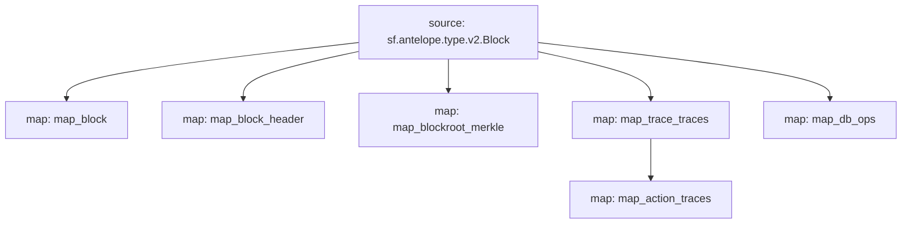

# Antelope `Common` Substream

> Antelope **action traces** & **database operations**.

## Mermaid graph



### Substream

| Name                 | IPFS hash |
|----------------------|-----------|
| `common-v0.2.0.spkg` | `QmfE7kdRAPihhvij4ej3rUM2Sp3PcXQ9rTFCQPhPGB5dr5`
| `common-v0.3.0.spkg` | `Qmb5KN1zayAArWYaispw8LEn9u482nFoUMHFyZKpr9dxq5`

### Map Modules

| Name                    | Hash
|-------------------------|--------------|
| map_block               | ba6bc8f56dfb3c59ebc305aeb59ec68a805c517f
| map_block_header        | a0b07fd7b1ce6f2910c2ee4d5b8cee1d0531a39f
| map_blockroot_merkle    | 84720a19b220c43fa165e9671f0baa71cb2d2069
| map_transaction_traces  | a5f40cf5d61267843112265f7723b905b6944a85
| map_action_traces       | 2dc0711448d94c7fcda431b2da710896adb96353
| map_db_ops              | 5f927ad914537a7eb684b04cf5b80b6b23aa3d18

### Quickstart

```
$ substreams run -e eos.firehose.eosnation.io:9001 substreams.yaml map_action_traces -s 284958698
```

### Build Protobuf

Generate protobuf code

```
$ substreams protogen ./substreams.yaml --exclude-paths="sf/antelope,sf/substreams,google"
```

To include **/src/pb/mod.rs**

```rs
#[path = "antelope.common.v1.rs"]
#[allow(dead_code)]
pub mod common;
```

### Build & Pack

```bash
$ cargo build --target wasm32-unknown-unknown --release
$ substreams pack ./substreams.yaml
```
