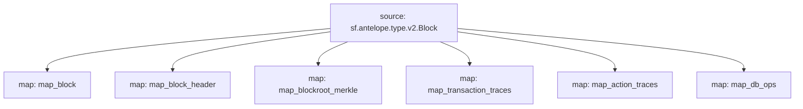

# Antelope `Common` Substream

> Antelope **action traces** & **database operations**.

## Mermaid graph



### Substream

| Name                 | IPFS hash |
|----------------------|-----------|
| `common-v0.3.0.spkg` | `QmdUPvbKoccXiZSHgsC5mpZMXQt6tuMsoYYf3foke2X5uV`
| `common-v0.2.0.spkg` | `QmfE7kdRAPihhvij4ej3rUM2Sp3PcXQ9rTFCQPhPGB5dr5`

### Map Modules

| Name                    | Hash
|-------------------------|--------------|
| map_block               | ceafe557414faffe8056c4ea65bcf00f25b4afb0
| map_block_header        | a2a7c25df2ce833ff7b407489ed6171939e25e30
| map_blockroot_merkle    | 182450c1f60f6367b7b51b4523b60edd9c359414
| map_transaction_traces  | 21245d57356849699d0c54c679e29b64fc690c14
| map_action_traces       | 2ca027126927ea9d38c8dc6597e9d75b0b47b475
| map_db_ops              | b4f15fbba0faf3fabe545125a645daff82dbdb77

### Quickstart

```
$ substreams run -e eos.firehose.eosnation.io:9001 substreams.yaml map_action_traces -s 284958698
```

### Build Protobuf

Generate protobuf code

```
$ substreams protogen ./substreams.yaml --exclude-paths="sf/antelope,sf/substreams,google"
```

To include **/src/pb/mod.rs**

```rs
#[path = "antelope.common.v1.rs"]
#[allow(dead_code)]
pub mod common;
```

### Build & Pack

```bash
$ cargo build --target wasm32-unknown-unknown --release
$ substreams pack ./substreams.yaml
```
