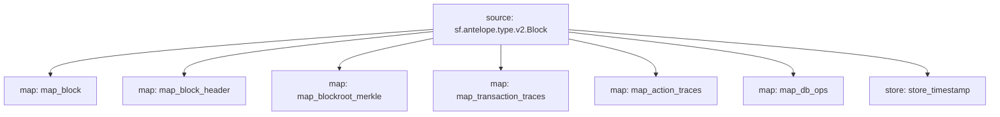

# Antelope `Common` Substream

> Antelope **action traces** & **database operations**.

## Mermaid graph



### Substream

| Name                 | IPFS hash |
|----------------------|-----------|
| `common-v0.3.0.spkg` | `QmdUPvbKoccXiZSHgsC5mpZMXQt6tuMsoYYf3foke2X5uV`
| `common-v0.2.0.spkg` | `QmfE7kdRAPihhvij4ej3rUM2Sp3PcXQ9rTFCQPhPGB5dr5`

### Modules

```yaml
Name: map_block
Initial block: 2
Kind: map
Output Type: proto:sf.antelope.type.v1.Block
Hash: 7fa2f6dfcc529c5c6b5475c45dadcce440237d1a

Name: map_block_header
Initial block: 2
Kind: map
Output Type: proto:sf.antelope.type.v1.BlockHeader
Hash: 8c5632a9f90e83154f64483515d422c48ef03633

Name: map_blockroot_merkle
Initial block: 2
Kind: map
Output Type: proto:sf.antelope.type.v1.BlockRootMerkle
Hash: 616305d3627edb11b97b8c7573fa23a487976d54

Name: map_transaction_traces
Initial block: 2
Kind: map
Output Type: proto:sf.antelope.type.v1.TransactionTraces
Hash: d49b88f6a4d44408b748f0490b43250640000762

Name: map_action_traces
Initial block: 2
Kind: map
Output Type: proto:sf.antelope.type.v1.ActionTraces
Hash: 179fab7cdd8f362130524d5169bb95b0e481cd1b

Name: map_db_ops
Initial block: 2
Kind: map
Output Type: proto:sf.antelope.type.v1.DBOps
Hash: 0fec3d3a2a72032e94c1b2d1372f37dd45931e31

Name: store_timestamp
Initial block: 2
Kind: store
Value Type: int64
Update Policy: UPDATE_POLICY_SET
Hash: 14828f8b73f412d36aeafef255c62e29d1135f2c
```