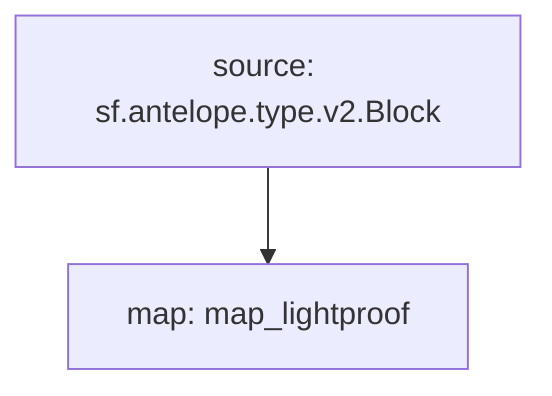

# Antelope `eosio.ibc` Substream

> Antelope `eosio.ibc` Lightproof **block** details.

### Quickstart

```
$ substreams run -e eos.firehose.eosnation.io:9001 substreams.yaml map_lightproof --stop-block 10000 --production-mode
```

### Graph



### Modules

```yaml
Name: map_lightproof
Initial block: 2
Kind: map
Output Type: proto:antelope.eosio.ibc.v1.Lightproof
Hash: 527e87617c2f55541a50ac2ee08377ac721479fc
```