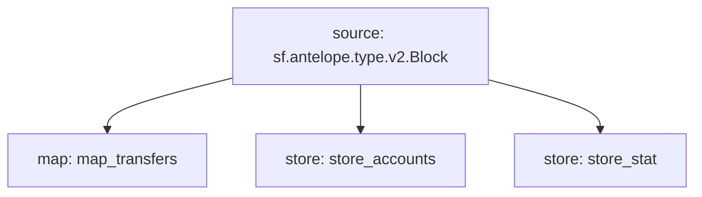

# Antelope `eosio.token` Substream

> Antelope `eosio.token` based **action traces** & **database operations**.

### Mermaid graph

### Substream

| Name                | Version     | IPFS hash |
|---------------------|-------------|-----------|
| `eosio-token.spkg`  | **v0.4.0**  | `QmbttxBK9FbV8E8g8g8jp8rpYDvK8QzEwSx4bQmafngXpJ`

### Map Modules

| Name                  | Hash      |
|-----------------------|-----------|
| `map_transfers`       | 0d74f81ffc681dd39a247e7109aec4f5de4ab519

### Stores Modules

| Name             | Key                            |  Hash     |
|------------------|--------------------------------|-----------|
| `store_accounts` | `{owner}:{contract}:{SYMCODE}` | 62379df73df1891983f4e2d4b30e97e95ba5c384
| `store_stat`     | `{contract}:{SYMCODE}`         | 798551e967042603c00dbc13d615b2ca56cb6511
