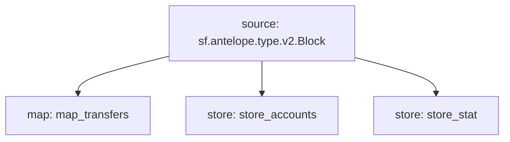

# Antelope `eosio.token` Substream

> Antelope `eosio.token` based **action traces** & **database operations**.


### Mermaid graph



### Substream

| Name                | Version     | IPFS hash |
|---------------------|-------------|-----------|
| `eosio-token.spkg`  | **v0.4.0**  | `QmbttxBK9FbV8E8g8g8jp8rpYDvK8QzEwSx4bQmafngXpJ`

### Map Modules

| Name                  | Description                          | Hash      |
|-----------------------|--------------------------------------|-----------|
| `map_transfers`       | all `eosio.token` transfer events    | 0d74f81ffc681dd39a247e7109aec4f5de4ab519

### Stores Modules

| Name             | Key                              |  Description                        | Hash    |
|------------------|----------------------------------|-------------------------------------|---------|
| `store_accounts` | `{contract}:{SYMCODE}`           |  all `eosio.token` account balances | 62379df73df1891983f4e2d4b30e97e95ba5c384
| `store_stat`     | `{owner}:{contract}:{SYMCODE}`   |  all `eosio.token` supply stat      | 798551e967042603c00dbc13d615b2ca56cb6511

### Protobuf

```proto
syntax = "proto3";

package antelope.eosio.token.v1;

import "google/protobuf/timestamp.proto";

message Account {
    bytes account = 1;
}

message CurrencyStats {
    bytes currency_stats = 1;
}

message TransferEvents {
    repeated TransferEvent items = 1;
}
  
message TransferEvent {
    // trace information
    uint32 block_num = 1;
    google.protobuf.Timestamp timestamp = 2;
    string trx_id = 3;
    uint32 action_ordinal = 4;

    // action data
    string account = 5;
    string symcode = 6;
    uint32 precision = 7;
    string from = 8;
    string to = 9;
    int64 amount = 10;
    string memo = 11;
}
```

### Quickstart

```
$ substreams run -e eos.firehose.eosnation.io:9001 substreams.yaml map_transfers -s 284958698
```

### Build Protobuf

Generate protobuf code

```
$ substreams protogen ./substreams.yaml --exclude-paths="sf/antelope,sf/substreams,google"
```

To include **/src/pb/mod.rs**

```rs
#[path = "antelope.eosio.token.v1.rs"]
#[allow(dead_code)]
pub mod eosio_token;
```

### Build & Pack

```bash
$ cargo build --target wasm32-unknown-unknown --release
$ substreams pack ./substreams.yaml
```
