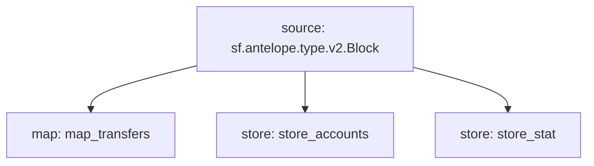

# Antelope `eosio.token` Substream

> Antelope `eosio.token` based **action traces** & **database operations**.

### Mermaid graph



### Substream

| Name                | Version     | IPFS hash |
|---------------------|-------------|-----------|
| `eosio-token.spkg`  | **v0.4.0**  | `QmbttxBK9FbV8E8g8g8jp8rpYDvK8QzEwSx4bQmafngXpJ`

### Modules

```yaml
Name: map_transfers
Initial block: 0
Kind: map
Output Type: proto:antelope.eosio.token.v1.TransferEvents
Hash: bd5fd62fceb947529d575c289ef5380a1b82d979

Name: store_accounts
Initial block: 2
Kind: store
Value Type: proto:antelope.eosio.token.v1.Account
Update Policy: UPDATE_POLICY_SET
Hash: f6b28186daf2eb993554be0630ae29f9fc27dc82

Name: store_stat
Initial block: 2
Kind: store
Value Type: proto:antelope.eosio.token.v1.CurrencyStats
Update Policy: UPDATE_POLICY_SET
Hash: 209ef1e5a628af0f652cdaf1396f705b16301d67
```