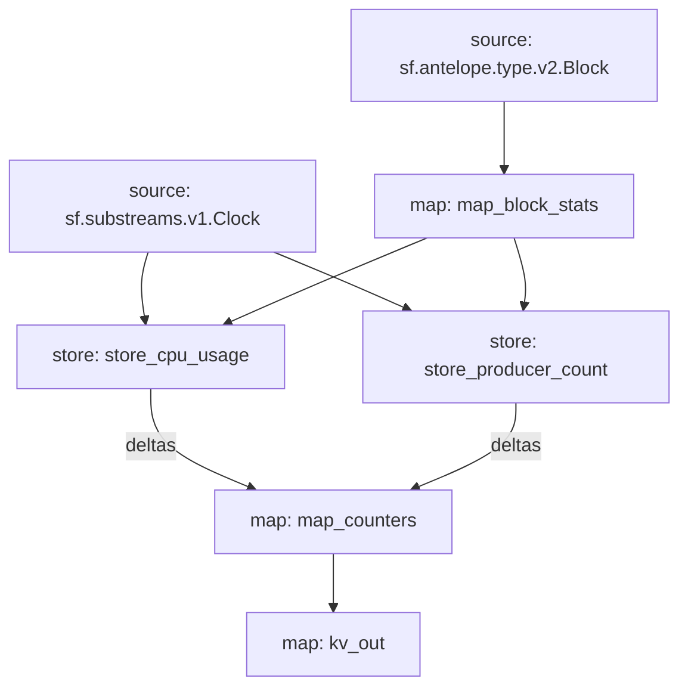

# Antelope `eosmechanics` Substream

> Block Producer Benchmarks

### Mermaid graph



### Modules

```yaml
Package name: eosmechanics
Version: v0.1.0
Doc: Block Producer Benchmarks
Modules:
----
Name: map_block_stats
Initial block: 0
Kind: map
Output Type: proto:eosmechanics.v1.BlockStats
Hash: 42b762c15212d33855be4e8b388c9ee135c022ce

Name: store_cpu_usage
Initial block: 0
Kind: store
Value Type: int64
Update Policy: UPDATE_POLICY_ADD
Hash: 2fb7dc629d8867ff0026bf0f4eedfb5cc21b8b7b

Name: store_producer_count
Initial block: 0
Kind: store
Value Type: int64
Update Policy: UPDATE_POLICY_ADD
Hash: bc374061deb5025b111bf99b2efa891f0463ecf8

Name: map_counters
Initial block: 0
Kind: map
Output Type: proto:eosmechanics.v1.KeyValues
Hash: d13d9c9b95893b3cbffebf7395cdcf7ce56a112a

Name: kv_out
Initial block: 0
Kind: map
Output Type: proto:sf.substreams.kv.v1.KVOperations
Hash: d1d3b76d5d2440dc5f06066bb35decdfafce325b
```